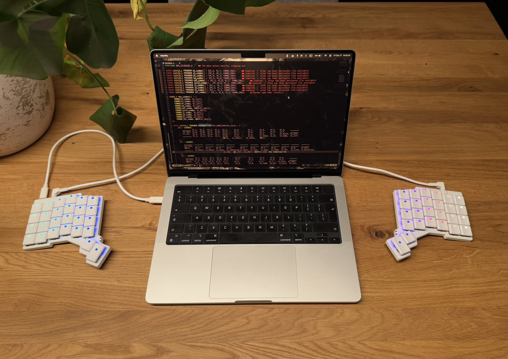

# My QMK configuration for [ZSA Voyager](https://www.zsa.io/voyager)



Latest version: https://github.com/mtyszkiewicz/qmk_firmware

## Installation
```shell
brew install qmk/qmk/qmk
qmk setup mtyszkiewicz/qmk_firmware
```

## Flashing
```shell
qmk flash -kb zsa/voyager -km mtyszkiewicz
```

## Web UI
```shell
qmk c2json -kb zsa/voyager -km mtyszkiewicz > keymap.json
```
- or download `keymap.json` from [here](./voyager/keymap.json).
- Import it at https://config.qmk.fm/#/
